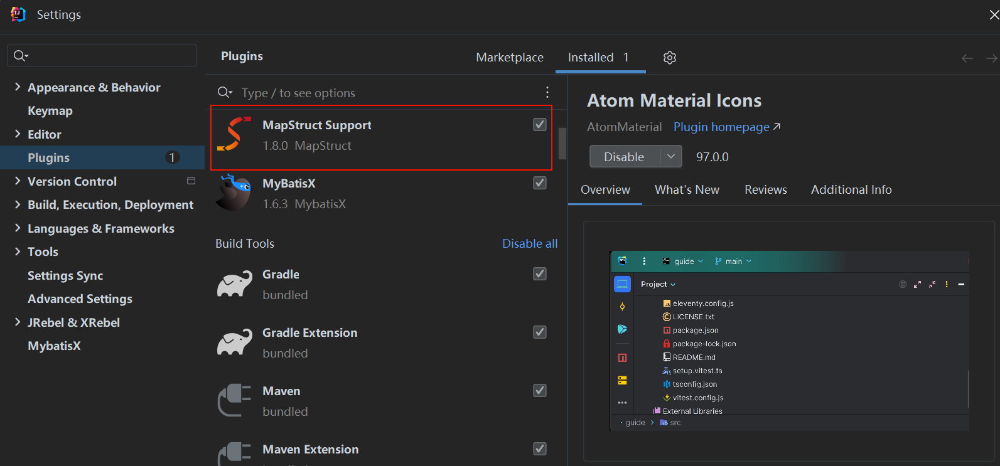

# SpringBoot 集成 MapStruct

在实际的项目中，对象转换不仅涉及简单的实体与 DTO 双向映射，还会面对多层嵌套、枚举映射、增量更新、不同日期格式处理、复杂的字段重命名和自定义逻辑调用等问题。手动编写转换代码繁琐、易错且难以维护。MapStruct 作为一种编译期代码生成工具，不仅提供简单、快捷的转换，还能通过合理的设计，将其扩展为一个“对象转换平台”，让开发者在各种复杂场景下仍能轻松、优雅地进行转换。

本文将从基础集成开始，一步步展示如何利用 MapStruct 和 Spring Boot 打造一个全方位考虑的转换库，包括全局配置、泛型支持、日期与枚举处理、自定义工具方法、增量更新和统一转换服务等场景的完整解决方案。

## 为什么需要对象转换平台？

现代应用常用分层架构和 DDD 思想分解复杂度，但在层与层之间的 DTO、VO、Entity、Domain 对象转换却频繁出现重复劳动和样板代码。一个灵活、可扩展的对象转换平台能帮助我们：

- 减少重复代码，提升团队生产力；
- 集中化管理转换策略（如 Null 值处理、日期格式），提高一致性；
- 快速应对需求变化，如增加新字段或修改字段命名；
- 简化复杂转换逻辑，让开发者更加专注业务本身。

## 为什么选择 MapStruct？

> 官方地址：https://mapstruct.org/


**MapStruct**的核心优势在于：

- **无反射高性能**：编译期间生成类型安全的映射代码，运行时无反射，性能优于常见的 Bean 拷贝工具。
- **强类型检查**：编译期即发现字段类型不匹配问题，提高转换过程的安全性和可维护性。
- **灵活配置**：支持字段重命名、类型转换、集合转换、日期格式处理，以及通过自定义表达式满足特殊场景。
- **降低重复劳动**：让开发者从繁琐的手工转换代码中解放出来，专注核心业务逻辑。

## 基础集成 MapStruct

在 `pom.xml` 中添加 MapStruct 依赖和相应的编译器插件（Maven）：

```xml
<properties>
    <mapstruct.version>1.5.5.Final</mapstruct.version>
    <lombok-mapstruct-binding.version>0.2.0</lombok-mapstruct-binding.version>
    <lombok.version>1.18.34</lombok.version>
</properties>

<dependencies>
    <!-- MapStruct -->
    <dependency>
        <groupId>org.mapstruct</groupId>
        <artifactId>mapstruct</artifactId>
        <version>${mapstruct.version}</version>
    </dependency>
    <!-- lombok -->
    <dependency>
        <groupId>org.projectlombok</groupId>
        <artifactId>lombok</artifactId>
        <version>${lombok.version}</version>
    </dependency>
</dependencies>

<build>
  <plugins>
    <plugin>
      <groupId>org.apache.maven.plugins</groupId>
      <artifactId>maven-compiler-plugin</artifactId>
      <configuration>
        <annotationProcessorPaths>
          	<!-- 使用 mapstruct 添加 -->
            <path>
                <groupId>org.mapstruct</groupId>
                <artifactId>mapstruct-processor</artifactId>
                <version>${mapstruct.version}</version>
            </path>
            <!-- 使用 mapstruct & Lombok 添加 -->
            <path>
                <groupId>org.projectlombok</groupId>
                <artifactId>lombok</artifactId>
                <version>${lombok.version}</version>
            </path>
            <!-- Lombok 1.18.16+ 添加，解决报错 -->
            <path>
                <groupId>org.projectlombok</groupId>
                <artifactId>lombok-mapstruct-binding</artifactId>
                <version>${lombok-mapstruct-binding.version}</version>
            </path>
        </annotationProcessorPaths>
      </configuration>
    </plugin>
  </plugins>
</build>
```

打开 IDEA 下载一个 MapStruct 插件可以更方便迅速的开发：



当使用 Spring Boot 与 MapStruct 时，一般无需额外配置，只需保证 MapStruct 注解处理器能在编译期执行。上面已通过 `maven-compiler-plugin` 指定注解处理器路径。

默认情况下，MapStruct 生成的 Mapper 不是 Spring Bean。我们可以通过在 Mapper 接口上添加 `@Mapper(componentModel = "spring")` 注解，将 Mapper 实例注册为 Spring Bean，从而在项目中通过 `@Autowired` 或者构造函数注入使用。

## 目录结构与封装思路

在 `infrastructure/converter` 目录下，我们将引入如下结构：

```tex
com.example.project
└─ infrastructure
   └─ converter
      ├─ config
      │  ├─ MapperBaseConfig.java      # 全局基础配置（如null处理、日期格式等）
      │  ├─ MapperCentralConfig.java   # 集成所有全局设定和复用组件的中央配置
      │  ├─ DateMappingConfig.java     # 专门处理日期格式转换的配置
      │  └─ EnumMappingConfig.java     # 专门处理枚举转换的配置（可选）
      ├─ base
      │  ├─ BaseMapper.java            # 定义通用的泛型双向转换方法
      │  ├─ BaseUpdatableMapper.java   # 可选，支持部分更新的Mapper扩展
      │  └─ ConversionService.java     # 提供统一的转换服务接口，封装Mapper调用
      ├─ util
      │  └─ CustomMappingUtils.java    # 自定义辅助转换方法（静态方法）
      ├─ annotations
      │  └─ IgnoreUnmapped.java        # 自定义注解，用于特定字段映射忽略策略
      ├─ mappers
      │  └─ (各领域对象对应的Mapper接口，如 UserMapper、EstablishmentMapper)
      └─ README.md                     # 对转换模块的说明文档（可选）
```

核心设计要点：

1. **全局配置与局部配置相结合**：使用 `MapperBaseConfig` 定义基础策略（如 `componentModel = "spring"`、`nullValueMappingStrategy`、`nullValuePropertyMappingStrategy`），在 `MapperCentralConfig` 中引用 `MapperBaseConfig` 并整合 `DateMappingConfig`、`EnumMappingConfig` 等。
2. **泛型BaseMapper**：`BaseMapper<E, D>` 定义 `E -> D` 与 `D -> E`、`List<E> -> List<D>` 的基本方法。
   在具体 Mapper 中继承该接口并添加 `@Mapper(config = MapperCentralConfig.class)` 即可直接获得双向转换方法，如需特殊字段映射可额外使用 `@Mapping`。
3. **增量更新支持（可选）**：定义 `BaseUpdatableMapper` 接口，增加 `updateEntityFromDto(D dto, @MappingTarget E entity)` 方法，用于只更新部分字段而不覆盖整个对象，适用于 PATCH 部分更新场景。
4. **日期与枚举处理**：在 `DateMappingConfig` 定义统一的日期格式和转换逻辑（如 `@DateFormat`），在 `EnumMappingConfig` 中可使用 `@Mapping(expression = ...)` 调用自定义工具方法，将枚举的 code 转成文本或反之。
5. **自定义注解与属性忽略**：可定义 `@IgnoreUnmapped` 注解，与 `MapperCentralConfig` 中的 `unmappedTargetPolicy = ReportingPolicy.IGNORE` 搭配使用，让未映射字段自动忽略或通过注解自定义处理策略。
6. **统一转换服务**：使用 `ConversionService`（非 Spring 的同名类，这里是我们自己的类）统一管理转换调用，对上层应用屏蔽对 mapper 的直接依赖，当需要替换或扩展转换逻辑时，只需修改 ConversionService 的实现即可。

## 全局与局部配置：打造统一转换规则

**MapperBaseConfig.java**（基础配置）：

```java
package com.example.project.infrastructure.converter.config;

import org.mapstruct.MapperConfig;
import org.mapstruct.NullValueCheckStrategy;
import org.mapstruct.ReportingPolicy;
import org.mapstruct.NullValuePropertyMappingStrategy;

@MapperConfig(
        componentModel = "spring", // 使用spring的依赖注入
        nullValueCheckStrategy = NullValueCheckStrategy.ALWAYS, // null值检查策略: 总是检查
        nullValuePropertyMappingStrategy = NullValuePropertyMappingStrategy.IGNORE, // null值属性映射策略: 忽略
        unmappedTargetPolicy = ReportingPolicy.IGNORE // 未映射字段不报错
)
public class MapperBaseConfig {
}
```

**DateMappingConfig.java**（日期格式配置）：

```java
package com.example.project.infrastructure.converter.config;

import org.mapstruct.MapperConfig;
import org.mapstruct.MappingConstants;
import org.mapstruct.Qualifier;

import java.text.SimpleDateFormat;
import java.util.Date;

@MapperConfig
public interface DateMappingConfig {

    @Qualifier
    @interface FormatDate {}

    @FormatDate
    static String formatDate(Date date) {
        if (date == null) return null;
        return new SimpleDateFormat("yyyy-MM-dd HH:mm:ss").format(date);
    }
}
```

**EnumMappingConfig.java**（枚举转换配置）：

> 有些业务场景中，需要统一处理枚举与字符串之间的转换。我们可以在 `EnumMappingConfig` 中定义静态方法，然后在 Mapper 中 `uses={EnumMappingConfig.class}` 或通过 `@Mapping(expression=...)` 调用。

```java
package com.example.project.infrastructure.converter.config;

import org.mapstruct.MapperConfig;
import org.mapstruct.Qualifier;

@MapperConfig
public interface EnumMappingConfig {

    @Qualifier
    @interface EnumToCode {}

    @Qualifier
    @interface CodeToEnum {}

    // 假设有一个UserType枚举
    public static enum UserType {
        ADMIN("A"), NORMAL("N");
        private final String code;
        UserType(String code) { this.code = code; }
        public String getCode() { return code; }
        public static UserType fromCode(String c) {
            for(UserType t : values()) {
                if(t.getCode().equals(c)) return t;
            }
            return null;
        }
    }

    @EnumToCode
    static String enumToCode(UserType userType) {
        return userType == null ? null : userType.getCode();
    }

    @CodeToEnum
    static UserType codeToEnum(String code) {
        return UserType.fromCode(code);
    }
}
```

**MapperCentralConfig.java**（中央整合配置）：

```java
package com.example.project.infrastructure.converter.config;

import org.mapstruct.MapperConfig;

@MapperConfig(
    uses = {DateMappingConfig.class},
    imports = MapperBaseConfig.class
)
public interface MapperCentralConfig {
}
```

这样，每个 Mapper 只需要 `@Mapper(config = MapperCentralConfig.class)` 即可继承全部规则。

## 泛型BaseMapper与增量更新支持

**BaseMapper.java**：

```java
package com.example.project.infrastructure.converter.base;

import org.mapstruct.MapperConfig;
import java.util.List;

@MapperConfig
public interface BaseMapper<E, D> {
    D toDto(E entity);
    E toEntity(D dto);

    List<D> toDtoList(List<E> entities);
    List<E> toEntityList(List<D> dtos);
}
```

**BaseUpdatableMapper.java**（支持增量更新，部分字段更新不会覆盖其他字段）：

```java
package com.example.project.infrastructure.converter.base;

import org.mapstruct.MappingTarget;

public interface BaseUpdatableMapper<E, D> extends BaseMapper<E, D> {
    void updateEntityFromDto(D dto, @MappingTarget E entity);
}
```

## 日期、枚举与自定义转换逻辑实现

自定义枚举转换（以 UserType enum为例）：

```java
package com.example.project.infrastructure.converter.config;

public enum UserType {
    ADMIN("A"), NORMAL("N");

    private final String code;
    
    UserType(String code) { this.code = code; }
    public String getCode() { return code; }

    public static UserType fromCode(String code) {
        for(UserType t : values()) {
            if(t.getCode().equals(code)) return t;
        }
        return null;
    }
}
```

在具体 Mapper 中：

```java
@Mapping(target = "userTypeCode", expression = "java(entity.getUserType() != null ? entity.getUserType().getCode() : null)")

@Mapping(target = "userType", expression = "java(dto.getUserTypeCode() != null ? UserType.fromCode(dto.getUserTypeCode()) : null)")
```

自定义工具类 `CustomMappingUtils`：

```java
package com.example.project.infrastructure.converter.util;

public class CustomMappingUtils {
    public static String safeToString(Object obj) {
        return obj == null ? "" : obj.toString();
    }
}
```

在Mapper中使用：

```java
@Mapping(target = "description", expression = "java(CustomMappingUtils.safeToString(entity.getDesc()))")
```

## 自定义注解与属性忽略策略

在实际业务中，我们可能希望对于某些字段未映射不报错，或者对特定字段进行特殊忽略。在已有 `unmappedTargetPolicy = ReportingPolicy.IGNORE` 后，通常未映射字段不会报错。但如果我们只想对部分字段有精确控制，可使用自定义注解标记，再在Mapper中通过 `@Mapping` 注解 `ignore = true` 来实现。

```java
package com.example.project.infrastructure.converter.annotations;

import java.lang.annotation.*;

@Target({ElementType.FIELD, ElementType.METHOD})
@Retention(RetentionPolicy.RUNTIME)
@Documented
public @interface IgnoreUnmapped {
    // 该注解本身只是一个标识，用于提示Mapper开发者可以对标注了此注解的字段进行忽略映射。
}
```

在需要忽略映射的字段处标记该注解，然后在对应的 Mapper 中对该字段进行 `@Mapping(target="xxx", ignore=true)`。此注解主要起标识与约定作用，可在代码审查中帮助明确哪些字段不需要映射。

## 统一转换服务的设计与实践

有了 `BaseMapper` 等接口后，应用层若频繁直接注入大量 Mapper，会很混乱。可设计  `ConversionService`  统一管理：

```java
package com.example.project.infrastructure.converter.base;

import org.springframework.stereotype.Service;
import java.util.List;

@Service
public class ConversionService {
    private final UserMapper userMapper; // 假设
    private final EstablishmentMapper establishmentMapper; // 假设

    public ConversionService(UserMapper userMapper, EstablishmentMapper establishmentMapper) {
        this.userMapper = userMapper;
        this.establishmentMapper = establishmentMapper;
    }

    public UserDto convertUserToDto(User user) {
        return userMapper.toDto(user);
    }

    public User convertDtoToUser(UserDto dto) {
        return userMapper.toEntity(dto);
    }

    public List<EstablishmentDto> convertEstablishmentsToDtos(List<Establishment> estList) {
        return establishmentMapper.toDtoList(estList);
    }

    // 其他转换方法...
}
```

上层服务（AppService）只需注入 `ConversionService`，无需关心底层 Mapper 实现。

## 不同场景的示例代码演示

### 场景一：简单双向转换（User）

```java
// User.java (Domain)
public class User {
    private Long id;
    private String name;
    private EnumMappingConfig.UserType userType;
    private java.util.Date createdAt;
    // getter/setter...
}

// UserDto.java (Application DTO)
public class UserDto {
    private Long id;
    private String fullName;
    private String userTypeCode; // "A" or "N"
    private String createdTime;  // "yyyy-MM-dd HH:mm:ss"
    // getter/setter...
}

// 使用 UserMapper 进行转换
User user = new User();
user.setId(100L);
user.setName("Alice");
user.setUserType(EnumMappingConfig.UserType.ADMIN);
user.setCreatedAt(new Date());

// toDto
UserDto dto = userMapper.toDto(user);
// dto.fullName <-- 需要在Mapper中加上@Mapping(target="fullName", source="name")
// 如果漏了映射，可以在UserMapper增加：@Mapping(target="fullName", source="name")

// toEntity
User user2 = userMapper.toEntity(dto);

// 部分更新(PATCH)
UserDto updateDto = new UserDto();
updateDto.setFullName("Alice New");
userMapper.updateEntityFromDto(updateDto, user);
// 这会只更新用户名，不改变 userType 与 createdAt
```

### 场景二：日期格式与自定义工具方法

假设我们需要将 `desc` 字段安全转换为字符串，同时日期字段转换为指定格式。在 `UserMapper` 中已经示例过通过 expression 调用 `DateMappingConfig.formatDate(...)` 和 `CustomMappingUtils.safeToString(...)`。

```java
@Mapping(target = "descStr", expression = "java(CustomMappingUtils.safeToString(entity.getDesc()))")
@Mapping(target = "createdTime", expression = "java(DateMappingConfig.formatDate(entity.getCreatedAt()))")
```

### 场景三：枚举转换

上例中 `UserType` 已演示，可通过 `qualifiedBy` 指定枚举转换方法：

```java
@Mapping(target = "userTypeCode", qualifiedBy = EnumMappingConfig.EnumToCode.class)
@Mapping(target = "userType", qualifiedBy = EnumMappingConfig.CodeToEnum.class)
```

### 场景四：属性忽略策略

有些字段不需要映射，比如在 `EstablishmentMapper` 中 `description` 字段 `ignore = true`。如果希望精确控制，在 `Establishment` 字段上加 `@IgnoreUnmapped` 注解表示此字段不需要映射，然后在Mapper中进行对应的ignore处理。

```java
public class Establishment {
    private Integer id;
    private String name;

    @IgnoreUnmapped
    private String internalCode; // 不对外暴露，也不需要映射
    // ...
}

@Mapper(config = MapperCentralConfig.class)
public interface EstablishmentMapper extends BaseMapper<Establishment, EstablishmentDto> {
    @Override
    @Mapping(target = "internalCode", ignore = true)
    EstablishmentDto toDto(Establishment entity);
}
```

### 场景五：统一转换服务

在应用服务（AppService）中，不希望直接依赖过多的Mapper，可以使用 `ConversionService`：

```java
// ConversionService.java 中
public class ConversionService {
    private final UserMapper userMapper;
    private final EstablishmentMapper establishmentMapper;

    public ConversionService(UserMapper userMapper, EstablishmentMapper establishmentMapper) {
        this.userMapper = userMapper;
        this.establishmentMapper = establishmentMapper;
    }

    public UserDto convertUserToDto(User user) {
        return userMapper.toDto(user);
    }

    public User convertDtoToUser(UserDto dto) {
        return userMapper.toEntity(dto);
    }

    public List<EstablishmentDto> convertEstablishmentsToDtos(List<Establishment> estList) {
        return establishmentMapper.toDtoList(estList);
    }
}
```

在 AppService 中使用：

```java
@Service
public class UserAppService {
    private final ConversionService conversionService;

    public UserAppService(ConversionService conversionService) {
        this.conversionService = conversionService;
    }

    public UserDto getUserDto(Long userId) {
        User user = ... // 从仓储获取Domain对象
        return conversionService.convertUserToDto(user);
    }
}
```

