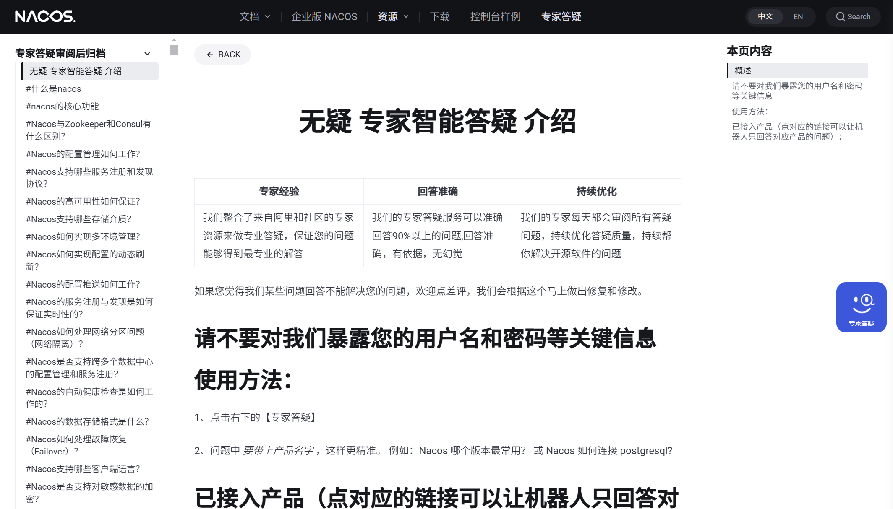

# SpringCloud Nacos

在当今微服务架构日益普及的背景下，服务的注册、发现与配置管理成为系统稳定运行的关键。阿里巴巴开源的 **Nacos**（Naming and Configuration Service）正是在此需求下诞生的强大工具。本文将全面解析 Nacos 的核心概念、架构设计、功能优势，并通过示例代码展示其在实际项目中的应用，帮助开发者高效构建和管理微服务架构。

## Nacos 简介

**Nacos**，全称为 **Naming and Configuration Service**，是阿里巴巴开源的一款集服务发现、配置管理、服务元数据及流量管理于一体的微服务组件。Nacos 主要用作服务注册中心和配置中心，旨在取代逐渐不再维护的 Spring Cloud Eureka 组件。目前，Nacos 主要支持 Java 语言，其他语言的支持正在积极开发中。

自2019年1月发布 Pre-GA 版本以来，Nacos 增强了安全隔离、监控和服务迁移等功能，确保在生产环境中的稳定性与高可用性，成为企业级微服务架构中的重要组件。

## Nacos 的优势

1. **易用性**
   * **简单的数据模型**：Nacos 提供直观的数据结构，便于理解与管理。
   * **标准的 RESTful API**：方便开发者进行集成与扩展。
   * **用户友好的控制台**：通过图形化界面轻松管理服务与配置。
   * **丰富的文档**：详尽的使用文档帮助快速上手与解决问题。
2. **稳定性**
   * **企业级 SLA**：Nacos 作为开源产品，具备高可用性，确保服务不间断运行。
   * **十年生产验证**：在阿里巴巴内部经过长期的生产环境验证，稳定可靠。
3. **实时性**
   * **毫秒级数据变更推送**：配置或服务变更能在极短时间内生效，确保系统的实时性与响应速度。
4. **规模与扩展性**
   * **支持百万级服务**：能够处理数百万级别的服务与配置，适用于大规模分布式系统。
   * **强大扩展性**：灵活的架构设计使其能够轻松应对业务增长与复杂需求。

## Nacos 核心功能

Nacos 的核心功能涵盖以下几个方面：

- **服务发现与健康监测**：自动注册与发现服务实例，实时监控服务健康状态。
- **动态配置管理**：集中管理应用配置，实现配置的动态更新与推送。
- **动态 DNS 服务**：提供高效的 DNS 服务，支持动态解析与负载均衡。
- **服务及其元数据管理**：管理服务的详细信息，包括版本、标签、权重等。

Nacos 不仅可以替代 Spring Cloud Eureka 作为服务注册中心，还能取代 Spring Cloud Config 作为配置中心，为微服务架构提供一站式解决方案。

## Nacos 核心概念

| 概念                                | 说明                                                         |
| ----------------------------------- | ------------------------------------------------------------ |
| 服务 (Service)                      | 服务是指一组具有特定功能的组件或应用，旨在被不同的客户端复用。通过网络调用，服务能够被其他应用按需调用，实现功能的共享与组合。 |
| 服务注册中心 (Service Registry)     | 服务注册中心是管理服务实例及其元数据的数据库。服务实例在启动时注册到注册中心，关闭时注销。客户端通过查询注册中心获取可用服务实例，支持健康检查确保服务的可用性。 |
| 服务元数据 (Service Metadata)       | 服务元数据包括服务端点、版本号、权重、路由规则、安全策略等描述性信息，用于详细定义服务的特性与行为。 |
| 服务提供方 (Service Provider)       | 提供可复用服务的应用。                                       |
| 服务消费方 (Service Consumer)       | 调用并使用服务的应用。                                       |
| 配置 (Configuration)                | 在系统开发中，配置指需要动态管理的参数或变量，通常独立于代码，以适应不同的运行环境。 |
| 配置管理 (Configuration Management) | 包括配置的编辑、存储、分发、变更管理、版本控制与审计等活动，确保配置的一致性与可追溯性。 |
| 名字服务 (Naming Service)           | 管理分布式系统中对象的命名与元数据映射，如服务发现与 DNS。   |
| 配置服务 (Configuration Service)    | 提供动态配置管理，支持配置的创建、更新与分发。               |

## Nacos 架构与原理

### 数据模型

Nacos 的数据模型由以下三个主要元素组成：

1. **Namespace（命名空间）**：用于多租户配置隔离，默认命名空间为 `public`。推荐使用运行环境作为命名空间（如开发、测试、生产），确保不同环境的配置与服务相互隔离。
2. **Group（分组）**：默认分组为 `DEFAULT_GROUP`。通常使用应用名作为分组，进一步组织与管理配置。
3. **Service/DataId（服务名/数据 ID）**：服务名用于服务注册与发现，DataId 用于配置管理。推荐使用由运行环境、应用名及功能模块组成的命名方式，确保唯一性。

### 通信机制

Nacos 在不同版本中采用了不同的通信机制：

- **Nacos 1.X**：使用 HTTP 1.1 短链接模拟长链接，每 30 秒发送心跳，检测配置变更并推送最新配置。
- **Nacos 2.X**：升级为长连接模式，支持 gRPC 通信，提升了通信效率与稳定性。新增 gRPC 端口（9848 和 9849），需要在防火墙或负载均衡器中进行相应配置。

> **注意**：在使用 VIP 或 Nginx 进行请求转发时，应配置 TCP 转发，避免使用 HTTP2 转发，以防连接中断。

### 一致性协议

在集群模式下，Nacos 需要保证各节点间的数据一致性与同步性，采用以下一致性协议：

1. **Raft 协议 (JRaft)**：
   * 提供强一致性，适用于持久化服务。
   * 支持多 RaftGroup，满足多数据分片需求。
2. **Distro 协议**：
   * Nacos 社区自研的 AP 分布式协议，适用于临时实例。
   * 集成了 Gossip 与 Eureka 协议，优化数据存储与同步。
   * 数据存储在缓存中，启动时进行全量同步，定期校验数据。

> **应用场景**：
>
> * **临时实例**：适用于需要高可用性与弹性扩展的场景，采用最终一致性协议，确保在部分节点故障时系统依然可用。
> * **持久实例**：适用于需要强一致性的场景，采用 Raft 协议，确保所有节点的数据同步一致。

### 负载均衡与实例管理

#### 实例分类

| 类型     | 特点                                                         |
| -------- | ------------------------------------------------------------ |
| 临时实例 | 存储于注册中心，需定期发送心跳；健康检查失败后自动删除；适用于流量突增与动态扩容场景。 |
| 持久实例 | 永久存储于注册中心，需主动注销；健康检查失败仅标记不健康，不自动删除；便于运维监控与预防措施。 |

#### 健康检查

Nacos 支持**客户端主动心跳**与**服务端探测**两种健康检查方式，根据实例类型选择适当的检查机制。**健康阈值**用于防止因过多实例不健康导致的流量压力，保证系统的稳定性。

健康阈值配置：

```yaml
spring:
  cloud:
    nacos:
      discovery:
        protectThreshold: 0.8 # 设置健康保护阈值为80%
```

### 安全性与鉴权

自 Nacos 2.1.0 版本起，Nacos 支持通过 SPI 注入鉴权插件，并在配置文件中选择具体实现。鉴权信息主要包括身份信息、资源与操作类型，确保只有授权用户才能执行相应操作。

配置示例：

```properties
nacos.core.auth.plugin.nacos.token.secret.key=VGhpc0lzTXlDdXN0b21TZWNyZXRLZXkwMTIzNDU2Nzg=
```

> **注意**：密钥应为 Base64 编码，且原始长度不低于32字符，以符合 JWT 规范。

## 性能与扩展性

**服务发现（Nacos 2.0）**：

* **实例容量**：支持百万级服务及实例，集群运行稳定。
* **注册/注销 TPS**：达到 26000 以上，较 Nacos 1.X 提升 2 倍。
* **查询实例 TPS**：达到 30000 以上，较 Nacos 1.X 提升 3 倍。

**配置管理（Nacos 2.0）**：

* **读 QPS**：14000，较 Nacos 1.X 提升 75%。
* **写 TPS**：2500，保持稳定。
* **长链接支持**：超过 40000，较 Nacos 1.X 提升 7 倍。
* **变更推送**：1500/s，提升配置实时性。

> **备注**：以上数据来源于Nacos官方，仅供参考，实际表现可能因环境而异。

## Nacos 与 Eureka 对比

| 特性            | Nacos                    | Eureka                   |
| --------------- | ------------------------ | ------------------------ |
| 注册中心        | 支持                     | 支持                     |
| 配置中心        | 支持                     | 不支持                   |
| 服务发现单机TPS | 30680.48                 | 6431                     |
| 服务注册单机TPS | 26784.84                 | 4793                     |
| 架构            | AP/CP                    | AP                       |
| 水平扩展        | 存算合一，不支持水平扩展 | 存算合一，不支持水平扩展 |
| 健康检查        | 主动探测+客户端心跳/连接 | 客户端心跳               |
| 推空保护        | 支持                     | 支持                     |
| 可定制          | 插件化                   | 插件化                   |
| 负载均衡        | 支持                     | 不支持                   |
| 跨地域容灾      | 不支持                   | 不支持                   |

> **总结**：Nacos 在性能、功能与灵活性方面明显优于 Eureka，特别是在配置管理与负载均衡方面，Nacos 提供了更全面的支持，是构建现代微服务架构的理想选择。

## Nacos 部署模式

Nacos 支持以下三种部署模式：

1. **单机模式**：适用于开发测试与单机试用环境。
2. **集群模式**：适用于生产环境，确保高可用性。
3. **多集群模式**：适用于多数据中心场景，支持跨区域部署。

> **集群模式**需依赖 MySQL 作为存储，支持 AP（临时实例）与 CP（持久实例） 模式。默认使用临时节点（AP），确保系统高可用性。

> **Docker 部署**：Nacos 提供官方 Docker 镜像，支持通过容器化方式快速部署与扩展。
>
> **Docker 镜像地址**：https://github.com/nacos-group/nacos-docker
>
> **Kubernetes 集成**：通过 StatefulSets 提供自动化运维方案，实现动态扩缩容，适应业务需求变化。

## Nacos 环境搭建（单机模式）

> 以下以 Linux 环境为例，介绍如何搭建单机测试环境。

### 前置条件

- **JDK 1.8+**：确保已安装并配置好 Java 环境。
- **MySQL 5.6.5+**：用于 Nacos 独立数据库模式。

### 安装与配置

**下载 Nacos 安装包**：

```bash
wget https://github.com/alibaba/nacos/releases/download/2.3.2/nacos-server-2.3.2.zip

unzip nacos-server-2.3.2.zip -d nacos

cd nacos
```

**修改默认端口**：编辑 `conf/application.properties` 文件，将默认端口 `8848` 修改为 `7001`（或别的端口）。

```properties
server.port=7001
```

**配置数据库**：Nacos 支持内置 MySQL，但需手动配置。

执行数据库脚本：

```bash
mysql -u root -p silentli < conf/mysql-schema.sql
```

添加 MySQL 数据源信息：在 `conf/application.properties` 文件中添加

```properties
spring.datasource.platform=mysql
spring.sql.init.platform=mysql

db.num=1
db.url.0=jdbc:mysql://localhost:3306/silentli?characterEncoding=utf8&connectTimeout=1000&socketTimeout=3000&autoReconnect=true
db.user=root
db.password=12345678
```

配置自定义密钥（Nacos 2.2.1+）：为避免启动异常，需设置 Base64 编码的密钥，长度不少于32字符

```properties
nacos.core.auth.plugin.nacos.token.secret.key=VGhpc0lzTXlDdXN0b21TZWNyZXRLZXkwMTIzNDU2Nzg=
```

启动 Nacos：

```bash
sh bin/startup.sh -m standalone
```

验证启动：使用 `jps` 命令查看 Nacos 进程

```bash
jps -l

# 输出示例：
# 95892 org.springframework.boot.loader.JarLauncher
```

停止 Nacos：

```bash
sh bin/shutdown.sh
```

> **备注**：Nacos 默认不支持 HTTPS，如需启用，可通过 Nginx 进行 SSL 终端配置，将 443 端口映射至 Nacos 的 7001 端口，并在 Nginx 上管理证书。

### 访问 Nacos 控制台

启动成功后，可通过浏览器访问 Nacos 控制台：http://localhost:7001/nacos/

**默认登录凭证**：

* **用户名**：`nacos`
* **密码**：`nacos`

## Nacos 环境搭建（集群模式）

> 集群部署适用于生产环境，提供高可用性与负载均衡，确保系统在部分节点故障时依然稳定运行。

### 准备集群环境

确保多台服务器（至少3台）可用于部署 Nacos 集群，以实现高可用性。假设有三台服务器：

- Server1: 192.168.1.1
- Server2: 192.168.1.2
- Server3: 192.168.1.3

### 安装与配置 MySQL

集群模式下，Nacos 需要一个独立的 MySQL 数据库作为存储。

创建数据库与用户：

```sql
CREATE DATABASE nacos_config;

CREATE USER 'nacos'@'%' IDENTIFIED BY 'nacos_password';

GRANT ALL PRIVILEGES ON nacos_config.* TO 'nacos'@'%';

FLUSH PRIVILEGES;
```

执行数据库脚本：

```bash
mysql -u nacos -p nacos_config < conf/mysql-schema.sql
```

在每台服务器上执行以下命令：

```bash
wget https://github.com/alibaba/nacos/releases/download/2.3.2/nacos-server-2.3.2.zip

unzip nacos-server-2.3.2.zip -d nacos

cd nacos
```

编辑 `conf/application.properties` 文件，进行集群配置。application.properties 集群配置示例：

```properties
# 修改服务端口（可保持默认8848）
server.port=8848

# 配置数据库
spring.datasource.platform=mysql
spring.sql.init.platform=mysql

db.num=1
db.url.0=jdbc:mysql://192.168.1.100:3306/nacos_config?characterEncoding=utf8&connectTimeout=1000&socketTimeout=3000&autoReconnect=true
db.user=nacos
db.password=nacos_password

# 集群节点列表
nacos.core.cluster.conf=nacos1.conf,nacos2.conf,nacos3.conf

# 配置自定义密钥
nacos.core.auth.plugin.nacos.token.secret.key=VGhpc0lzTXlDdXN0b21TZWNyZXRLZXkwMTIzNDU2Nzg=
```

创建 `conf/cluster.conf` 文件，列出集群中的所有节点。`cluster.conf` 配置示例：

```markdown
192.168.1.1:8848
192.168.1.2:8848
192.168.1.3:8848
```

> 确保每台服务器上的 `cluster.conf` 文件内容一致。

在每台服务器上执行启动命令：

```bash
sh bin/startup.sh -m cluster
```

访问任意一台服务器的 Nacos 控制台：http://192.168.1.1:8848/nacos/

> **默认登录凭证**：nacos/nacos

在 Nacos 控制台的 "集群状态" 页面，确认所有节点均为健康状态。

## 服务注册与发现

服务注册与发现是微服务架构中的核心机制，Nacos 提供了简洁高效的实现方式。

### 服务注册机制

**Spring Cloud** 提供 `ServiceRegistry` 接口用于服务注册，Nacos 通过其 `NacosServiceRegistry` 实现该接口，简化了服务注册流程。

（1）在微服务项目中添加 Nacos 依赖：

```xml
<!-- Nacos 服务发现依赖 -->
<dependency>
    <groupId>com.alibaba.cloud</groupId>
    <artifactId>spring-cloud-starter-alibaba-nacos-discovery</artifactId>
</dependency>
```

（2）可以考虑将 Nacos 注册中心配置放在通用配置项目（如 `xxxx-common`）下，供各微服务共用。

```yaml
# application-dev.yml 配置示例
spring:
  cloud:
    nacos:
      discovery:
        server-addr: ${nacos.server-address}
```

（3）在资源过滤文件 application-filter-dev.properties 中添加变量。

```properties
nacos.server-address=localhost:7001
```

（4）在各微服务的 application.yml 中激活相应配置。

```yaml
spring:
  profiles:
    active: dev
```

> Spring Boot 将自动根据 profiles 加载 `application-{profiles}.yml` 中的配置。

### 服务发现机制

>  通过 `DiscoveryClient` 接口，微服务可以轻松发现并调用其他服务。

（1）在微服务主类上添加 `@EnableDiscoveryClient` 注解：

```java
import org.springframework.boot.SpringApplication;
import org.springframework.boot.autoconfigure.SpringBootApplication;
import org.springframework.cloud.client.discovery.EnableDiscoveryClient;

@SpringBootApplication
@EnableDiscoveryClient // 启用服务发现
public class Application {
    public static void main(String[] args) {
        SpringApplication.run(Application.class, args);
    }
}
```

（2）服务消费者示例：

```java
import org.springframework.beans.factory.annotation.Autowired;
import org.springframework.cloud.client.ServiceInstance;
import org.springframework.cloud.client.discovery.DiscoveryClient;
import org.springframework.web.bind.annotation.GetMapping;
import org.springframework.web.bind.annotation.RestController;

import java.util.List;

@RestController
public class ServiceConsumerController {

    @Autowired
    private DiscoveryClient discoveryClient;

    @GetMapping("/discover")
    public List<ServiceInstance> discoverServices() {
        // 获取所有名为 'order-service' 的服务实例
        return discoveryClient.getInstances("order-service");
    }
}
```

（3）服务提供者示例：

```java
import org.springframework.web.bind.annotation.GetMapping;
import org.springframework.web.bind.annotation.RestController;

@RestController
public class OrderController {

    @GetMapping("/orders")
    public String getOrders() {
        return "List of orders";
    }
}
```

### 服务注册发现流程

1. **服务注册**：服务提供者启动时，将自身注册到 Nacos 注册中心。
2. **心跳维持**：临时实例需定期发送心跳，确保注册中心保持其活跃状态。
3. **服务订阅**：服务消费者订阅所需服务，获取可用实例列表。
4. **负载均衡**：消费者根据负载均衡策略选择实例进行调用。
5. **实例调用**：消费者调用选定的服务实例，完成服务请求。

> 最佳实践：
>
> 1. **命名规范**：使用清晰的命名规范（如 `env-app-feature`）确保服务与配置的唯一性与可读性。
> 2. **配置管理**：将配置文件与代码分离，使用 Nacos 的动态配置功能，避免频繁重启服务。
> 3. **健康检查**：合理配置健康检查机制，确保系统稳定性，防止雪崩效应。
> 4. **安全配置**：启用鉴权与加密，保护注册中心与配置中心的安全，避免潜在风险。
> 5. **高可用部署**：在生产环境中采用集群模式，确保 Nacos 的高可用性与稳定性。

## 服务配置管理

### 集成配置管理

在实际项目中，配置管理同样至关重要，建议同时引入 `nacos-config` 依赖，以充分利用 Nacos 的配置管理功能。

在 `pom.xml` 中同时添加以下依赖：

```xml
<!-- Nacos 配置管理依赖 -->
<dependency>
    <groupId>com.alibaba.cloud</groupId>
    <artifactId>spring-cloud-starter-alibaba-nacos-config</artifactId>
</dependency>
```

`bootstrap.yml` 配置示例：

```yaml
spring:
  application:
    name: order-service
  cloud:
    nacos:
      discovery:
        server-addr: localhost:7001
      config:
        server-addr: localhost:7001
        file-extension: yaml
        namespace: dev
        group: DEFAULT_GROUP
        shared-configs:
          - data-id: application-dev.yaml
            refresh: true
```

### 动态配置刷新

>  动态配置刷新是微服务架构中提高系统灵活性与可维护性的关键功能之一。Nacos 提供了强大的动态配置管理能力，使得配置变更无需重启服务即可生效。

动态配置刷新基于以下几个关键点：

1. **配置监听**：客户端通过长连接监听配置中心的配置变更事件。
2. **配置变更通知**：当配置发生变更时，配置中心通知所有订阅了该配置的客户端。
3. **自动刷新**：客户端接收到通知后，自动拉取最新配置并刷新应用上下文中的相关 Bean。

要实现动态配置刷新，需要在项目中进行以下配置与开发步骤：

1. 如前文所述，需同时引入 `nacos-discovery` 与 `nacos-config` 依赖。
2. 在 `bootstrap.yml` 中配置 Nacos 配置中心相关信息。（见上面的 `bootstrap.yml` 配置示例）

为了使 Bean 在配置变更时自动刷新，需要在相关 Bean 上添加 `@RefreshScope` 注解。

示例如下：

```java
import org.springframework.beans.factory.annotation.Value;
import org.springframework.cloud.context.config.annotation.RefreshScope;
import org.springframework.web.bind.annotation.RestController;
import org.springframework.web.bind.annotation.GetMapping;

/**
 * 动态配置控制器，展示动态配置刷新功能。
 */
@RefreshScope
@RestController
public class DynamicConfigController {

    @Value("${order.service.message}")
    private String serviceMessage;

    /**
     * 获取动态配置的服务消息。
     */
    @GetMapping("/dynamic-message")
    public String getDynamicMessage() {
        return serviceMessage;
    }
}
```

> 说明：
>
> * **@RefreshScope**：标注在类上，表示该 Bean 的属性会随着配置的刷新而动态更新。
> * **@Value**：注入配置中心的属性值。

当配置中心的配置文件（如 `application-dev.yaml`）发生变更后，Nacos 会通过长连接通知客户端，客户端会自动拉取最新配置并刷新 `@RefreshScope` 注解的 Bean。

除了自动刷新外，还可以通过 Spring Actuator 的 `/actuator/refresh` 端点手动触发刷新。

在 `application.yml` 中添加：

```yaml
management:
  endpoints:
    web:
      exposure:
        include: refresh
```

使用 `curl` 命令触发刷新：

```http
curl -X POST http://localhost:7001/actuator/refresh
```

## 配置参考

### 单点环境

```yaml
# Spring Boot 应用基本配置
spring:
  application:
    # 应用名称，会作为 Nacos 的 ${prefix}
    name: xxx-service
  # Spring Cloud 配置
  cloud:
    nacos:
      # 配置中心相关配置
      config:
        # Nacos 服务器地址及端口，支持多个地址以逗号分隔。单点环境通常只有一个地址，如 127.0.0.1:8848
        server-addr: ${nacos.config.server-addr:127.0.0.1:8848}
        # 配置命名空间，用于隔离不同环境或模块的配置。默认使用 'public' 命名空间
        namespace: ${nacos.config.namespace:public}
        # 配置文件的格式，支持 'yaml'、'properties' 等。根据项目需求选择
        file-extension: ${nacos.config.file-extension:yaml}
        # 扩展配置，用于加载额外的配置文件
        extension-configs:
          - # 额外配置文件的 Data ID，使用占位符以支持动态配置
            data-id: ${nacos.config.extension-data-id:common-config.yaml}
            # 是否支持动态刷新，设置为 'true' 以启用动态刷新功能
            refresh: ${nacos.config.extension-refresh:true}
        # Nacos 的认证信息，确保配置中心的安全性
        username: ${nacos.config.username:nacos}
        password: ${nacos.config.password:nacos}
        # 共享配置，多个项目可以共享同一配置文件
        shared-configs:
          - # 共享配置文件的 Data ID
            data-id: ${nacos.config.shared-data-id:shared-config.yaml}
            # 是否支持动态刷新
            refresh: ${nacos.config.shared-refresh:true}
      # 服务发现相关配置
      discovery:
        # Nacos 服务发现的服务器地址，与配置中心相同
        server-addr: ${nacos.discovery.server-addr:127.0.0.1:8848}
        # 使用的命名空间，建议与配置中心命名空间保持一致
        namespace: ${nacos.discovery.namespace:public}
        # 服务发现的认证信息
        username: ${nacos.discovery.username:nacos}
        password: ${nacos.discovery.password:nacos}
        # 服务名称，通常使用应用名称
        service: ${spring.application.name}
        # 健康检查配置，确保服务注册的有效性
        health-check:
          # 是否启用健康检查，建议在生产环境中启用
          enabled: ${nacos.discovery.health-check.enabled:true}
          # 健康检查的间隔时间（毫秒），根据实际需求调整
          period: ${nacos.discovery.health-check.period:30000}
      # 配置服务连接相关设置
      config-service:
        # 连接配置中心的超时时间（毫秒），避免长时间阻塞
        timeout: ${nacos.config-service.timeout:5000}
        # 自定义 Nacos 配置中心的 endpoint，可选配置
        endpoint:
          # 自定义路径，默认 '/nacos'
          path: ${nacos.config-service.endpoint.path:/nacos}
          # 自定义上下文，默认 '/nacos'
          context: ${nacos.config-service.endpoint.context:/nacos}

# 日志相关配置
logging:
  # 日志级别配置，使用占位符以支持动态调整
  level:
    # 指定包名及其日志级别，默认 'INFO'
    ${logging.level.package:com.yourcompany}: ${logging.level.level:INFO}
  # 日志格式配置
  pattern:
    # 控制台日志输出格式，使用占位符配置
    console: ${logging.pattern.console:"%d{yyyy-MM-dd HH:mm:ss} - %msg%n"}

# 服务器相关配置
server:
  # 应用启动端口，使用占位符以支持不同环境的配置
  port: ${server.port:8080}
  
# 安全相关配置，建议在生产环境中启用
security:
  # 基本认证配置
  basic:
    # 是否启用基本认证，建议启用
    enabled: ${security.basic.enabled:true}
  # OAuth2 客户端配置，如果使用 OAuth2 认证方式
  oauth2:
    client:
      # OAuth2 客户端 ID
      client-id: ${security.oauth2.client.client-id:your-client-id}
      # OAuth2 客户端密钥
      client-secret: ${security.oauth2.client.client-secret:your-client-secret}
      # 访问令牌 URI，OAuth2 授权服务器地址
      access-token-uri: ${security.oauth2.client.access-token-uri:https://auth-server/oauth/token}
      # 用户授权 URI，OAuth2 授权服务器地址
      user-authorization-uri: ${security.oauth2.client.user-authorization-uri:https://auth-server/oauth/authorize}
```

### 集群环境

```yaml
# Spring Boot 应用的基本配置
spring:
  application:
    # 应用名称，使用占位符以提高灵活性。默认值为 'your-application-name'
    name: ${app.name:your-application-name}
  # Spring Cloud 的配置
  cloud:
    nacos:
      # 配置中心相关配置
      config:
        # Nacos 集群服务器地址及端口，支持多个地址以逗号分隔
        server-addr: ${nacos.config.server-addr:nacos-cluster-node1:8848,nacos-cluster-node2:8848,nacos-cluster-node3:8848}
        # 配置命名空间，用于隔离不同环境或模块的配置。默认使用 'your-namespace-id'
        namespace: ${nacos.config.namespace:your-namespace-id}
        # 配置文件的格式，支持 'yaml'、'properties' 等。根据项目需求选择
        file-extension: ${nacos.config.file-extension:yaml}
        # 扩展配置，用于加载额外的配置文件
        extension-configs:
          - # 额外配置文件的 Data ID，使用占位符以支持动态配置
            data-id: ${nacos.config.extension-data-id:common-config.yaml}
            # 是否支持动态刷新，设置为 'true' 以启用动态刷新功能
            refresh: ${nacos.config.extension-refresh:true}
        # Nacos 的认证信息，确保配置中心的安全性
        username: ${nacos.config.username:nacos}
        password: ${nacos.config.password:nacos}
        # 共享配置，多个项目可以共享同一配置文件
        shared-configs:
          - # 共享配置文件的 Data ID
            data-id: ${nacos.config.shared-data-id:shared-config.yaml}
            # 是否支持动态刷新
            refresh: ${nacos.config.shared-refresh:true}
        # 指定 Nacos 集群的名称，确保客户端连接到正确的集群
        cluster-name: ${nacos.config.cluster-name:nacos-cluster}
      # 服务发现相关配置
      discovery:
        # Nacos 集群服务发现的服务器地址，支持多个地址以逗号分隔
        server-addr: ${nacos.discovery.server-addr:nacos-cluster-node1:8848,nacos-cluster-node2:8848,nacos-cluster-node3:8848}
        # 使用的命名空间，建议与配置中心命名空间保持一致
        namespace: ${nacos.discovery.namespace:your-namespace-id}
        # 服务发现的认证信息
        username: ${nacos.discovery.username:nacos}
        password: ${nacos.discovery.password:nacos}
        # 服务名称，通常使用应用名称
        service: ${spring.application.name}
        # 健康检查配置，确保服务注册的有效性
        health-check:
          # 是否启用健康检查，建议在生产环境中启用
          enabled: ${nacos.discovery.health-check.enabled:true}
          # 健康检查的间隔时间（毫秒），根据实际需求调整
          period: ${nacos.discovery.health-check.period:30000}
      # 配置服务连接相关设置
      config-service:
        # 连接配置中心的超时时间（毫秒），避免长时间阻塞
        timeout: ${nacos.config-service.timeout:5000}
        # 自定义 Nacos 配置中心的 endpoint，可选配置
        endpoint:
          # 自定义路径，默认 '/nacos'
          path: ${nacos.config-service.endpoint.path:/nacos}
          # 自定义上下文，默认 '/nacos'
          context: ${nacos.config-service.endpoint.context:/nacos}
        # 负载均衡配置（可选），根据实际需求启用
        # load-balancer:
        #   ribbon:
        #     enabled: ${nacos.config-service.load-balancer.ribbon.enabled:true}

# 日志相关配置
logging:
  # 日志级别配置，使用占位符以支持动态调整
  level:
    # 指定包名及其日志级别，默认 'INFO'
    ${logging.level.package:com.yourcompany}: ${logging.level.level:INFO}
  # 日志格式配置
  pattern:
    # 控制台日志输出格式，使用占位符配置
    console: ${logging.pattern.console:"%d{yyyy-MM-dd HH:mm:ss} - %msg%n"}

# 服务器相关配置
server:
  # 应用启动端口，使用占位符以支持不同环境的配置
  port: ${server.port:8080}

# 安全相关配置，建议在生产环境中启用
security:
  # 基本认证配置
  basic:
    # 是否启用基本认证，建议启用
    enabled: ${security.basic.enabled:true}
  # OAuth2 客户端配置，如果使用 OAuth2 认证方式
  oauth2:
    client:
      # OAuth2 客户端 ID
      client-id: ${security.oauth2.client.client-id:your-client-id}
      # OAuth2 客户端密钥
      client-secret: ${security.oauth2.client.client-secret:your-client-secret}
      # 访问令牌 URI，OAuth2 授权服务器地址
      access-token-uri: ${security.oauth2.client.access-token-uri:https://auth-server/oauth/token}
      # 用户授权 URI，OAuth2 授权服务器地址
      user-authorization-uri: ${security.oauth2.client.user-authorization-uri:https://auth-server/oauth/authorize}

# 高可用相关配置
spring:
  cloud:
    nacos:
      discovery:
        # 优先使用 IP 地址进行服务注册，适用于动态 IP 环境
        prefer-ip-address: ${nacos.discovery.prefer-ip-address:true}
        # 心跳检测配置，保持服务的实时性
        heart-beat:
          # 心跳发送的间隔时间（毫秒）
          interval: ${nacos.discovery.heart-beat.interval:5000}
          # 心跳超时时间（毫秒）
          timeout: ${nacos.discovery.heart-beat.timeout:15000}
```

## 常见问题

Nacos 的常见问题可以在 Nacos 官方站点查阅：https://nacos.io/blog/wuyi-intro/?spm=5238cd80.2f31cf4d.0.0.2d6c126c2K1PCl



# 参考资料

- [Nacos 官方文档](https://nacos.io/docs/latest/overview/?spm=5238cd80.297dad21.0.0.271de37evU3hLK)
- [Nacos GitHub 仓库](https://github.com/alibaba/nacos)
- [Nacos Docker 镜像](https://github.com/nacos-group/nacos-docker)
- [Spring Cloud Alibaba Nacos 集成指南](https://github.com/alibaba/spring-cloud-alibaba)