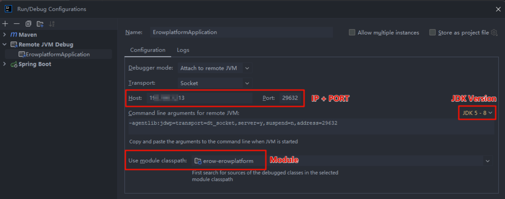

# 远程 Debug

## Edit Configuration

IDEA 配置对应服务的 Remote JVM Debug：



关键配置如下：

- Host：远程服务的 IP 地址
- Port：用于远程 Debug 的端口号（不重复的可用端口即可）
- JDK：选择项目的 JDK 版本，版本不同下面的脚本会自动调整
- Module：对应作用的模块

对于 Command line arguments for remote JVM，不同版本有不同的脚本：

```Bash
# JDK 5-8
-agentlib:jdwp=transport=dt_socket,server=y,suspend=n,address=29632

# JDK 9 or later（因为 jdk9 安全考虑，远程调试只允许本地，如果要远程，则需要在端口前配置 *）
-agentlib:jdwp=transport=dt_socket,server=y,suspend=n,address=*:29632
```

## 修改启动脚本

最后在启动脚本中使用 Command line arguments for remote JVM 值即可，例如：

```Bash
nohup java \
-agentlib:jdwp=transport=dt_socket,server=y,suspend=n,address=29632 \
-jar remote-debug-1.0.0.jar &
```

> 相关补充：
>
> 1. 如果远程调试在自己的断点处停下来了，此时关闭IDEA中的项目停止运行，则还会继续运行执行完剩下的逻辑；
> 2. IDEA 里的代码如果不和 jar 包的一致，需要保证和远程启动的代码一致，否则你 debug 的时候的行数会对不上；
> 3. 日志不会打印在 IDEA 的控制台上。即 System.out 以及 log.info 还是打印在远程；
> 4. 远程调试的时候，打了断点，停住后会导致页面的请求卡住；


